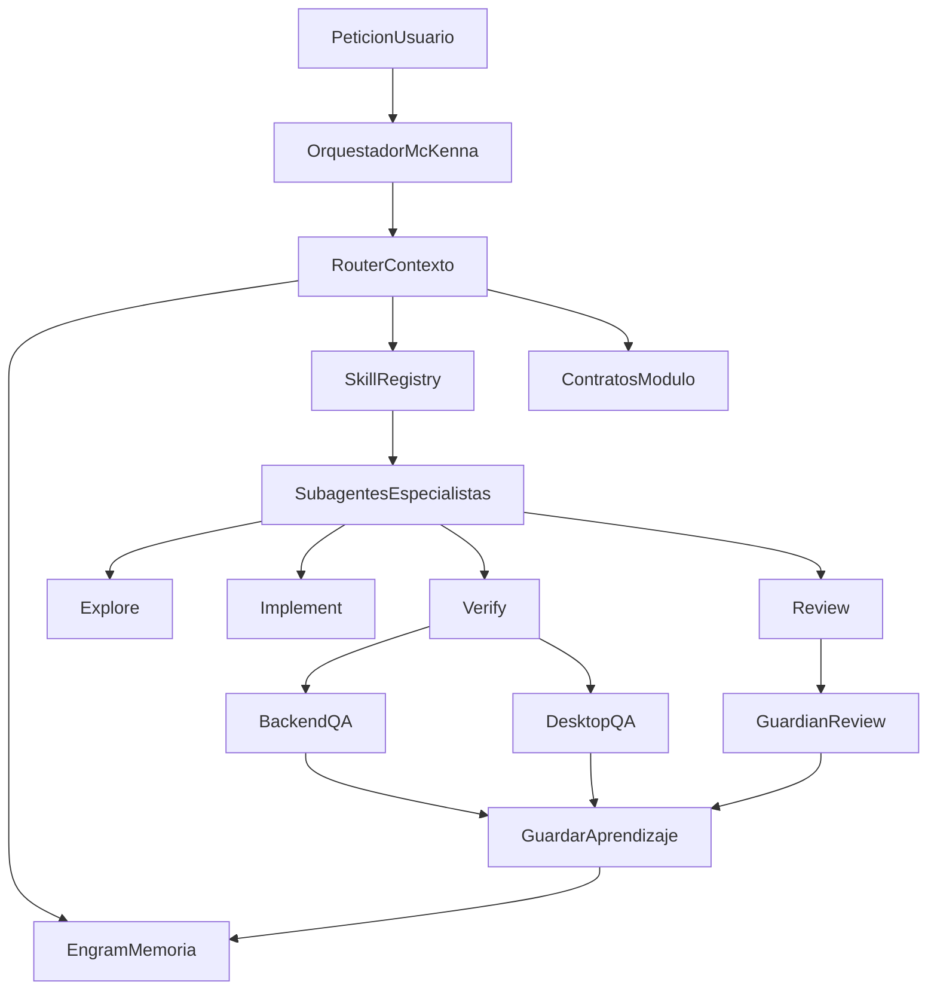

# Gentleman Ecosystem For McKenna

Objetivo: usar el ecosistema Gentleman como referencia para superagentes en McKenna sin instalar herramientas globales a ciegas. Primero se documenta la arquitectura; instalacion real debe hacerse en una tarea separada con backup.

## Repos Evaluados

| Repo | Rol en el ecosistema | Como aplica a McKenna |
| --- | --- | --- |
| `Gentleman-Programming/gentle-ai` | Configurador central: SDD, orquestacion, skills, MCP, Engram, persona y multi-agent. | Capa objetivo para convertir nuestro flujo `docs/agentic/` en setup administrado. |
| `Gentleman-Programming/engram` | Memoria persistente agent-agnostic: Go binary, SQLite + FTS5, CLI, HTTP API, MCP, TUI y sync. | Evolucion natural de `docs/agentic/MEMORY.md` + Chroma/debug-memory local. |
| `Gentleman-Programming/agent-teams-lite` | Implementacion anterior: orchestrator + subagents + SDD en Markdown. Archivado/deprecado. | Referencia conceptual; no instalar como base nueva. `gentle-ai` lo reemplaza. |
| `Gentleman-Programming/Gentleman-Skills` | Skills comunitarias/curadas para agentes. | Fuente de skills externas: React 19, TypeScript, pytest, Playwright, patrones frontend/backend. |
| `Gentleman-Programming/gentleman-guardian-angel` | AI code review provider-agnostic para commits/PRs. | Capa opcional de revision pre-commit/PR encima de `backend-qa` y `desktop-qa`. |
| `Gentleman-Programming/Gentleman.Dots` | Entorno dev: editor, shells, terminales, tmux/zellij; capa AI vive en `gentle-ai`. | Opcional para estandarizar maquinas dev, no necesario para servidor productivo. |

## Arquitectura Objetivo

## Delegacion Automatica

El orquestador debe analizar lenguaje natural y decidir:

| Intencion detectada | Skill/subagente | Contexto minimo |
| --- | --- | --- |
| "preguntas MeLi", "orders_v2", "messages" | `webhook-meli` + Explore/Verify | `docs/agentic/modules/webhook-meli.md` |
| "WhatsApp", "resp", "posventa", "comprobante" | `whatsapp-routes` + Explore | `docs/agentic/modules/whatsapp-routes.md` |
| "tool", "Claude", "prompt", "Hugo responde" | `core-tools` + Review | `docs/agentic/modules/core-tools.md` |
| "stock", "facturas", "Siigo", "MeLi sync" | `sync-stock` + Explore/Verify | `docs/agentic/modules/sync-stock.md` |
| "panel", "React", "Vite", "dashboard" | `desktop-panel` + Verify | `docs/agentic/modules/desktop-panel.md` |
| "systemd", "puerto", "nohup", "deploy" | `ops-systemd` + Explore | `docs/agentic/modules/ops-systemd.md` |
| "tests", "CI", "regresion" | `backend-qa` + Verify | `docs/agentic/modules/backend-qa.md` |
| "review", "PR", "commit seguro" | `guardian-review` | `docs/agentic/modules/guardian-review.md` |

## Fases De Adopcion

1. **Ya implementado local:** `docs/agentic/`, contratos, smoke tests, CI backend.
2. **Siguiente paso seguro:** instalar/evaluar `engram` en entorno dev, no en produccion, y mapear memorias McKenna a `mem_save`.
3. **Despues:** evaluar `gentle-ai` para configurar Cursor/otros agentes con SDD, skills registry y Engram.
4. **Luego:** incorporar skills externas seleccionadas de `Gentleman-Skills` como skills reales de Cursor o fichas locales.
5. **Finalmente:** evaluar `gentleman-guardian-angel` como review pre-commit/PR. No bloquear commits productivos hasta calibrar reglas.
6. **Opcional:** usar `Gentleman.Dots` en maquinas dev para entorno consistente; no requerido en servidor.

## Reglas De Seguridad

- No instalar binarios globales en servidor productivo sin backup y ventana de mantenimiento.
- No sincronizar memoria con secretos, tokens, `.env` ni credenciales.
- `agent-teams-lite` queda como referencia historica; preferir `gentle-ai`.
- Skills externas se importan de forma selectiva; no copiar catálogos completos sin revisar triggers.
- Guardian/review no debe auto-modificar produccion; solo reportar hasta calibrar.

## Links Fuente

- https://github.com/Gentleman-Programming/gentle-ai
- https://github.com/Gentleman-Programming/engram
- https://github.com/Gentleman-Programming/agent-teams-lite
- https://github.com/Gentleman-Programming/Gentleman-Skills
- https://github.com/Gentleman-Programming/gentleman-guardian-angel
- https://github.com/Gentleman-Programming/Gentleman.Dots
