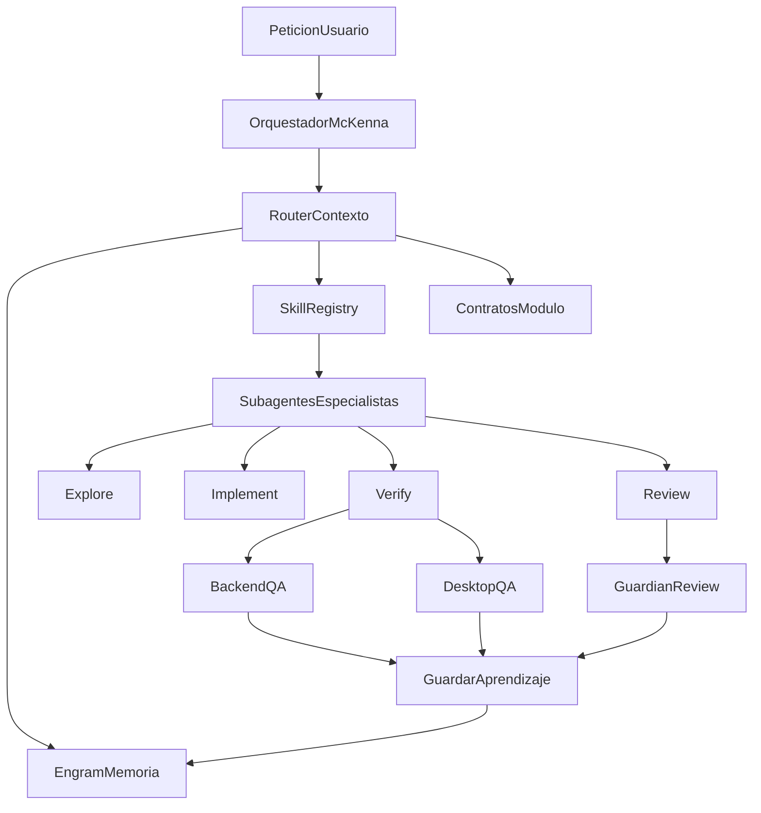

# Gentleman Ecosystem For McKenna

Objetivo: usar el ecosistema Gentleman como referencia para superagentes en McKenna sin instalar herramientas globales a ciegas.

## Estado real de la instalacion (verificado 2026-09-20)

Este documento describia el ecosistema como algo *por evaluar*. No lo es: dos de las
herramientas llevan meses instaladas y corriendo en esta maquina, y ambas estan atrasadas.

| Herramienta | Instalado | Ultimo publicado | Ruta / dato |
| --- | --- | --- | --- |
| `gentle-ai` | **3.4.0** ✅ | 3.4.0 | `/usr/local/bin/gentle-ai` — actualizado el 20-sep-2026 desde 1.25.4 |
| `engram` | **2.0.0** ✅ | 2.0.0 | `/usr/local/bin/engram`, base en `~/.engram/engram.db` — actualizado el 20-sep-2026 desde 1.15.4 |
| `archify` | **instalado** ✅ | 2.17.0 | Skills `archify` + `archify-review` en `~/.agents/skills/`, enlazadas desde `~/.claude/skills/`. Primer diagrama en `docs/arquitectura/` — ver su `README.md` |

Instalados desde los tarballs oficiales de GitHub (no hay Homebrew en esta maquina, y el
Go local 1.22.2 es viejo para compilar v2). Respaldo previo en
`~/backups_manual/engram_20260920/`: la base mas los dos binarios viejos, por si hay que volver.

## Lo que ninguna de las dos hace todavia por mi-agente

Actualizarlas no las conecto al proyecto, y conviene no confundir las dos cosas:

- **Engram tenia un solo proyecto en el store, `eth-usdc-bot`** (100 observaciones, 7 sesiones,
  sin escrituras desde el 6-may-2026). mi-agente no tenia ni una memoria. Tras el upgrade se
  verifico que v2 escribe y lee bien en este repo, que Engram detecta como `hugogarciaagente`
  por el remoto de git. La memoria viva de McKenna sigue estando en
  `~/.claude/projects/-home-mckg-mi-agente/memory/`, en ChromaDB (`memoria_vectorial/`) y en
  `docs/agentic/MEMORY.md` — mapearla a `mem_save` sigue pendiente.
- **gentle-ai nunca se instalo en este repo**: no hay `.atl/`, y las skills de
  `.agents/skills/` y `.cursor/skills/` (las `caveman*`) se pusieron a mano, no las gestiona el.
  `gentle-ai sdd-status` responde `unresolved / next: sdd-new`, que es lo normal en un repo sin
  SDD iniciado. Correr `gentle-ai install` o `sync` cambiaria configuraciones de agentes en toda
  la maquina: es una decision aparte, no parte de actualizar.

⚠️ **`engram doctor` sale en `error` y no es por el upgrade.** Los dos hallazgos
(`sync_target_closed_space` y `sync_mutation_required_fields`, 107 mutaciones sin confirmar)
son de `eth-usdc-bot`, de mayo, hacia un destino cloud que nunca se configuro. `doctor repair
--dry-run` los marca `repairable: false`. Son de otro proyecto: no se tocaron.

## Repos Evaluados

| Repo | Rol en el ecosistema | Como aplica a McKenna |
| --- | --- | --- |
| `Gentleman-Programming/gentle-ai` | Configurador central: SDD, orquestacion, skills, MCP, Engram, persona y multi-agent. | Capa objetivo para convertir nuestro flujo `docs/agentic/` en setup administrado. |
| `Gentleman-Programming/engram` | Memoria persistente agent-agnostic: Go binary, SQLite + FTS5, CLI, HTTP API, MCP, TUI y sync. | Evolucion natural de `docs/agentic/MEMORY.md` + Chroma/debug-memory local. |
| `Gentleman-Programming/agent-teams-lite` | Implementacion anterior: orchestrator + subagents + SDD en Markdown. Archivado/deprecado. | Referencia conceptual; no instalar como base nueva. `gentle-ai` lo reemplaza. |
| `Gentleman-Programming/Gentleman-Skills` | Skills comunitarias/curadas para agentes. | Fuente de skills externas: React 19, TypeScript, pytest, Playwright, patrones frontend/backend. |
| `Gentleman-Programming/gentleman-guardian-angel` | AI code review provider-agnostic para commits/PRs. | Capa opcional de revision pre-commit/PR encima de `backend-qa` y `desktop-qa`. |
| `Gentleman-Programming/Gentleman.Dots` | Entorno dev: editor, shells, terminales, tmux/zellij; capa AI vive en `gentle-ai`. | Opcional para estandarizar maquinas dev, no necesario para servidor productivo. |

## Arquitectura Objetivo

```mermaid
flowchart TD
    UserRequest[PeticionUsuario] --> MainOrchestrator[OrquestadorMcKenna]
    MainOrchestrator --> ContextRouter[RouterContexto]
    ContextRouter --> EngramMemory[EngramMemoria]
    ContextRouter --> SkillRegistry[SkillRegistry]
    ContextRouter --> ModuleContracts[ContratosModulo]
    SkillRegistry --> SpecialistAgents[SubagentesEspecialistas]
    SpecialistAgents --> ExploreAgent[Explore]
    SpecialistAgents --> ImplementAgent[Implement]
    SpecialistAgents --> VerifyAgent[Verify]
    SpecialistAgents --> ReviewAgent[Review]
    VerifyAgent --> BackendQA[BackendQA]
    VerifyAgent --> DesktopQA[DesktopQA]
    ReviewAgent --> GGAReview[GuardianReview]
    BackendQA --> LearningWrite[GuardarAprendizaje]
    DesktopQA --> LearningWrite
    GGAReview --> LearningWrite
    LearningWrite --> EngramMemory
```

## Delegacion Automatica

El orquestador debe analizar lenguaje natural y decidir:

| Intencion detectada | Skill/subagente | Contexto minimo |
| --- | --- | --- |
| "preguntas MeLi", "orders_v2", "messages" | `webhook-meli` + Explore/Verify | `docs/agentic/modules/webhook-meli.md` |
| "WhatsApp", "resp", "posventa", "comprobante" | `whatsapp-routes` + Explore | `docs/agentic/modules/whatsapp-routes.md` |
| "tool", "Claude", "prompt", "Hugo responde" | `core-tools` + Review | `docs/agentic/modules/core-tools.md` |
| "stock", "facturas", "Alegra", "MeLi sync" | `sync-stock` + Explore/Verify | `docs/agentic/modules/sync-stock.md` |
| "panel", "React", "Vite", "dashboard" | `desktop-panel` + Verify | `docs/agentic/modules/desktop-panel.md` |
| "systemd", "puerto", "nohup", "deploy" | `ops-systemd` + Explore | `docs/agentic/modules/ops-systemd.md` |
| "tests", "CI", "regresion" | `backend-qa` + Verify | `docs/agentic/modules/backend-qa.md` |
| "review", "PR", "commit seguro" | `guardian-review` | `docs/agentic/modules/guardian-review.md` |

## Fases De Adopcion

1. **Ya implementado local:** `docs/agentic/`, contratos, smoke tests, CI backend.
2. **Ya instalado (no es un paso pendiente):** `engram` 1.15.4 y `gentle-ai` 1.25.4 estan en
   `/usr/local/bin`. El paso real pendiente es **actualizarlos** (ver tabla de estado arriba),
   no instalarlos.
3. **Pendiente de verdad:** mapear las memorias McKenna de `docs/agentic/MEMORY.md` a `mem_save`
   de Engram, que hoy convive con Chroma sin que ninguno sea la fuente de verdad.
4. **Luego:** incorporar skills externas seleccionadas de `Gentleman-Skills` como skills reales de Cursor o fichas locales.
5. **Finalmente:** evaluar `gentleman-guardian-angel` como review pre-commit/PR. No bloquear commits productivos hasta calibrar reglas.
6. **Opcional:** usar `Gentleman.Dots` en maquinas dev para entorno consistente; no requerido en servidor.

## Reglas De Seguridad

- No instalar binarios globales en servidor productivo sin backup y ventana de mantenimiento.
- No sincronizar memoria con secretos, tokens, `.env` ni credenciales.
- `agent-teams-lite` queda como referencia historica; preferir `gentle-ai`.
- Skills externas se importan de forma selectiva; no copiar catálogos completos sin revisar triggers.
- Guardian/review no debe auto-modificar produccion; solo reportar hasta calibrar.

## Links Fuente

- https://github.com/Gentleman-Programming/gentle-ai
- https://github.com/Gentleman-Programming/engram
- https://github.com/Gentleman-Programming/agent-teams-lite
- https://github.com/Gentleman-Programming/Gentleman-Skills
- https://github.com/Gentleman-Programming/gentleman-guardian-angel
- https://github.com/Gentleman-Programming/Gentleman.Dots
