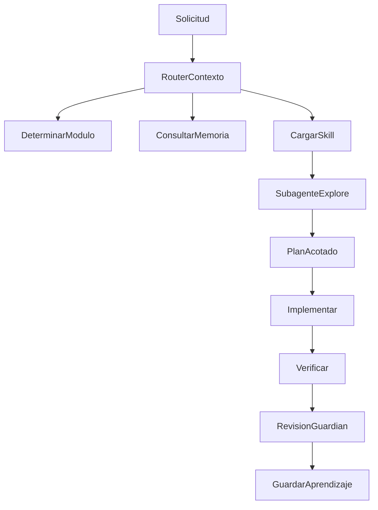

# Orchestration Protocol

Metodo para pasar de cambios por intuicion a desarrollo agentico controlado.

## Roles

| Rol | Responsabilidad | Escribe codigo |
| --- | --- | --- |
| Orquestador | Mantiene objetivo, alcance, memoria y plan. Decide subagentes y validacion. | Solo si el cambio es pequeno |
| RouterContexto | Clasifica intencion en skill/modulo, consulta memoria y limita tokens. | No |
| Explore | Lee codigo y devuelve mapa, riesgos, archivos y contratos. | No |
| Implement | Hace cambio acotado con archivos definidos. | Si |
| Verify | Ejecuta pruebas, auditoria, lints o revisa diff. | Solo fixes pequenos |
| Review | Busca regresiones y huecos de tests. | No por defecto |
| Guardian | Revision AI estilo pre-commit/PR sobre diff y reglas del repo. | No |

## Flujo



## Ecosistema Externo

La arquitectura local se alinea con el ecosistema Gentleman:

- `gentle-ai`: configurador central para SDD, skills, MCP, Engram, persona y subagentes.
- `engram`: memoria persistente via SQLite + FTS5, CLI, HTTP API, MCP y sync.
- `agent-teams-lite`: referencia historica archivada; preferir `gentle-ai`.
- `Gentleman-Skills`: fuente de skills externas seleccionables.
- `gentleman-guardian-angel`: revision AI pre-commit/PR.
- `Gentleman.Dots`: entorno dev; la capa AI vive en `gentle-ai`.

Ver `docs/agentic/ECOSYSTEM.md`.

## Cuándo Usar Subagentes

Usar subagentes cuando:

- El cambio toca mas de una capa: Flask, React, cron, WhatsApp, MeLi, systemd.
- Hay que entender un modulo grande como `app/routes.py` o `app/core.py`.
- El objetivo es investigativo o ambiguo.
- Conviene correr exploracion y verificacion en paralelo.

No usar subagentes cuando:

- Se conoce el archivo exacto y el cambio es pequeno.
- Solo se corrige texto/documentacion.
- Se necesita una busqueda exacta de simbolo; usar `rg`.

## Contrato del Orquestador

Antes de editar:

- Objetivo en una frase.
- Modulo principal y secundarios.
- Archivos que se van a tocar.
- Invariantes que no se pueden romper.
- Validacion minima.

Despues de editar:

- Pruebas ejecutadas.
- Riesgo residual.
- Aprendizaje reusable guardado o motivo para no guardarlo.

## Salida Esperada de Explore

Formato corto:

```text
Modulo:
Archivos:
Flujo:
Riesgos:
Validacion:
Cambios sugeridos:
```

## Salida Esperada de Verify

Formato corto:

```text
Comandos:
Resultado:
Fallas:
Riesgo no cubierto:
```
